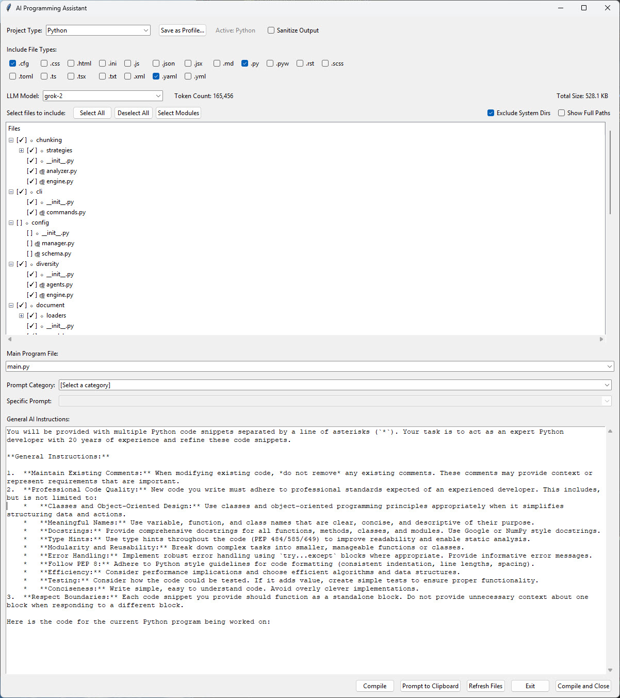

# AI Programming Assistant

 

A desktop GUI tool designed to prepare and compile your project's codebase into a single, optimized prompt for AI coding assistants. It helps you select relevant files, manage token limits, and sanitize sensitive data before sending your code to LLMs.

Early on in using AI as an assistant to programming, I realized through experimentation with various models
that I had a need to quickly (and repeatedly) compile multiple source code files from disk into
a format that AI could make use of. It was clear that the context window would become corrupt and the
only way to make further progress on a project, especially on larger projects, was to create a new chat 
session, with a clean context window, providing the source as it currently existed. Many AI users do not
understand how pervasive and how serious context window corruption is.

[arXiv 2604.15597](https://arxiv.org/abs/2604.15597) -- LLMs Corrupt Your Documents When You Delegate -- recently (April 2026) showed that this is still a serious
problem:

> Our large-scale experiment with 19 LLMs reveals that current models degrade documents during delegation: even frontier models (Gemini 3.1 Pro, Claude 4.6 Opus, GPT 5.4) corrupt an average of 25% of document content by the end of long workflows, with other models failing more severely.

I also was playing with the idea of a library with versioned/dated prompts and other ideas that I eventually neglected. The main thing I needed, and still use, was the ability to select a project directory, set the language, perhaps have a default prompt and have it all wrapped into a single file I could attach into a clean context window.

In short, this tool represents present usefulness mixed with plans that fell by the wayside or that I never pursued: 
- The prompt library is dated. My prompts today look very different today than what's included but you can use them as starting points, replace them or ignore them.
- The PII feature is nice and needs to better integration. It really should be a checkbox on/off

## ✨ Features

*   **Intuitive GUI**: Browse your project directory and select files/folders using a visual tree view.
*   **Project Profiles**: Built-in support for Python and SPFx projects, plus the ability to create and save custom profiles.
*   **Smart Token Counting**: Real-time estimation of token counts for various LLM models (OpenAI, Anthropic, etc.) using `toksum`.
*   **Automatic Truncation**: Large files are automatically truncated based on profile settings to stay within context limits.
*   **Sensitive Data Sanitization**: Redact API keys, passwords, emails, and IPs with one click before posting code.
*   **Prompt Library**: Access a library of predefined prompts for common programming tasks.
*   **Clipboard Integration**: Compile your selected files and AI instructions directly to the clipboard.


---

## 🚀 Getting Started

### Prerequisites

*   Python 3.8 or higher
*   `tkinter` (usually included with Python, but may require separate installation on Linux)

### Installation

1.  Clone the repository:
    ```bash
    git clone https://github.com/yourusername/ai-programming-assistant.git
    cd ai-programming-assistant
    ```

2.  Install the required Python packages:
    ```bash
    pip install pyperclip toksum
    ```

### Running the Application

Execute the main script from your terminal:

```bash
python ai_programming_assistant.py
```

---

## 🛠️ Usage

1.  **Select Project Directory**: On launch, you will be prompted to select the root folder of your project.
2.  **Choose a Profile**: Select a project profile (e.g., Python, SPFx) that matches your project type. This automatically configures file exclusion rules and markers.
3.  **Select Files**:
    *   Use the file tree to check the boxes next to the files you want to include.
    *   Use the toolbar buttons to **Select All**, **Deselect All**, or **Select Modules** (files identified by profile markers like `__init__.py`).
4.  **Set Main File**: Choose the entry point of your application from the "Main Program File" dropdown. This file will be placed first in the compiled output.
5.  **AI Instructions**:
    *   Select a prompt from the **Prompt Library** dropdown, or
    *   Write your custom instructions in the "General AI Instructions" text box.
6.  **Sanitize (Optional)**: Click the **Sanitize** button to automatically redact sensitive information like API keys and passwords from your instructions.
7.  **Compile & Copy**:
    *   Click **Compile** to generate the output file (`For AI Questions.txt`) and copy the content to your clipboard without closing the dialog.
    *   Click **OK** to compile, copy, and close the application.

---

## 📁 Project Profiles

Profiles define how your project is analyzed and compiled.

| Profile | Description | Module Markers |
| :--- | :--- | :--- |
| **Python** | Standard Python projects. | `__init__.py` |
| **SPFx** | SharePoint Framework (TypeScript/React). | `package.json` |
| **Custom** | User-defined profiles saved at runtime. | User-defined |

*   **Auto-Detection**: The app attempts to detect the project type automatically upon directory selection.
*   **Custom Profiles**: You can save your current file type selections and instructions as a new profile using the **Save as Profile...** button.

<details>
<summary>📖 Profile Configuration Details</summary>

Profiles manage the following settings:
*   `excluded_dirs`: Directories to ignore (e.g., `node_modules`, `.git`).
*   `default_file_types`: File extensions to include by default.
*   `module_markers`: Filenames that identify a directory as a module.
*   `file_size_limits`: Max size (in bytes) for specific file types before truncation.
*   `default_instructions`: The default text to appear in the AI Instructions box.

</details>

---

## 🛡️ Sanitization

The **Sanitize** feature helps protect sensitive data. It uses regular expressions to find and redact patterns such as:

*   API Keys and Secrets (e.g., `api_key: "..."`, `CLIENT_SECRET = "..."`)
*   Passwords and Tokens
*   IP Addresses
*   Email Addresses
*   Azure AD Tenant/Client IDs (GUIDs)
*   URLs with authentication tokens

Example transformation:
```python
# Before Sanitization
api_key = "1234567890abcdef"
password = "supersecretpassword"

# After Sanitization
api_key: "[REDACTED]"
password: "[REDACTED]"
```

---

## ⚙️ Configuration

Application state is saved automatically between sessions.

*   **Windows**: `%APPDATA%\AIProgrammingAssistant\config.json`
*   **Linux/macOS**: `~/.config/AIProgrammingAssistant/config.json`

The configuration stores:
*   Last used directory and profile.
*   Selected LLM model for token counting.
*   File type override preferences per profile.
*   Directory-to-profile mappings.

---

## 📦 Dependencies

*   [pyperclip](https://pypi.org/project/pyperclip/): For cross-platform clipboard functionality.
*   [toksum](https://pypi.org/project/toksum/): For multi-provider token counting (uses `tiktoken` for OpenAI models).
*   [tkinter](https://docs.python.org/3/library/tkinter.html): Standard Python interface to the Tk GUI toolkit.

---

## 🤝 Contributing

Contributions are welcome! Please feel free to submit a Pull Request.

1.  Fork the Project
2.  Create your Feature Branch (`git checkout -b feature/AmazingFeature`)
3.  Commit your Changes (`git commit -m 'Add some AmazingFeature'`)
4.  Push to the Branch (`git push origin feature/AmazingFeature`)
5.  Open a Pull Request

## 📄 License
Copyright (c) 2026 Stephen Genusa. All rights reserved.
Distributed under the MIT License. See `LICENSE` for more information.